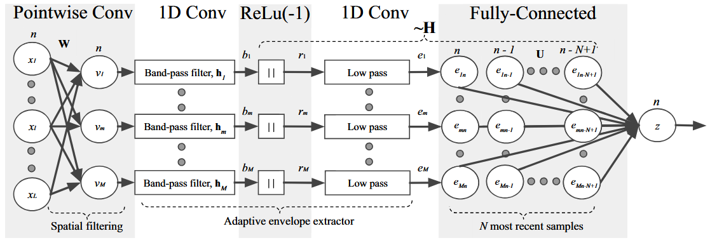
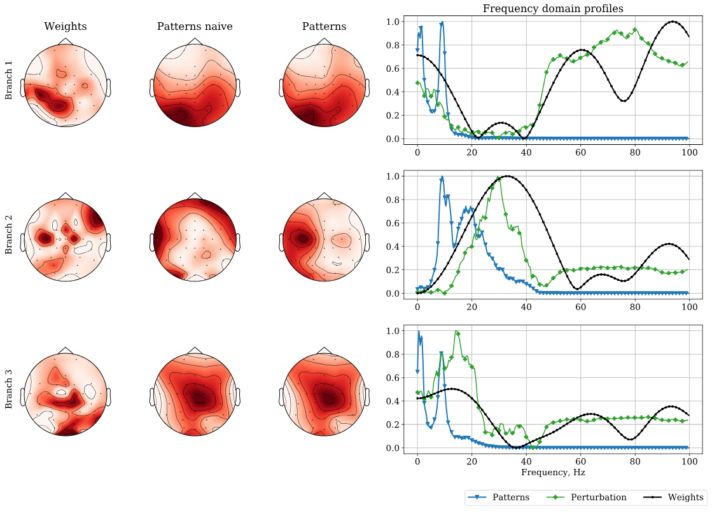

# EEGSimpleNet

<div align="center">
  
  <p><em>Architecture of EEGSimpleNet showing the spatio-temporal block, low-pass filter, and output layers. Taken from Artur Petrosyan et al. ecoding and interpreting cortical signals with a compact convolutional neural network. 2021 J. Neural Eng. 18 026019.</em></p>
</div>

EEGSimpleNet is a simple compact interpretable convolutional neural network architecture presented in Artur Petrosyan et al. ecoding and interpreting cortical signals with a compact convolutional neural network. 2021 J. Neural Eng. 18 026019. This repository provides an implementation of this architecture, code for weights interpretation and a demonstration notebook.

<div align="center">
  
  <p><em>Figure 2: Visualization of learned spatial patterns (topographies) and temporal patterns from the trained model. Taken from Artur Petrosyan et al. ecoding and interpreting cortical signals with a compact convolutional neural network. 2021 J. Neural Eng. 18 026019.</em></p>
</div>

# Repository structue

```
.
├── images/                   # Images for README
├── architecture.py           # Module with EEGSimpleNet architecture and its building blocks
├── plot_patterns.py          # Module with helper functions that plot patterns
├── demo.ipynb                # Demonstration notebook with training and interpretation
├── requirements.txt          # Main Python dependencies
├── requirements_demo.txt     # Additional Python dependencies to run demo.ipynb
└── README.md                 # Project documentation
```

# Installation

1. Clone the repository:
    ```bash
    git clone https://github.com/ivsemenkov/EEGSimpleNet.git
    cd EEGSimpleNet
    ```
2. Create conda environment and activate it
    ```bash
    conda create --name EEGSimpleNet python=3.11
    conda activate EEGSimpleNet
    ```
3. Install main dependencies:
    ```bash
    pip install -r requirements.txt
    ```
4. (Optional) If you want to run demo.ipynb also install additional dependencies:
    
    ```bash
    pip install -r requirements_demo.txt
    ```

# Usage

See `demo.ipynb` for an example of training EEGSimpleNet on your data and interpreting its weights.

# Citation

If you use this code, please cite:
> Petrosyan, A., et al. (2021). Decoding and interpreting cortical signals with a compact convolutional neural network. *J. Neural Eng.*, 18(2), 026019.

```
@article{Petrosyan_2021,
doi = {10.1088/1741-2552/abe20e},
url = {https://dx.doi.org/10.1088/1741-2552/abe20e},
year = {2021},
month = {mar},
publisher = {IOP Publishing},
volume = {18},
number = {2},
pages = {026019},
author = {Petrosyan, Artur and Sinkin, Mikhail and Lebedev, Mikhail and Ossadtchi, Alexei},
title = {Decoding and interpreting cortical signals with a compact convolutional neural network},
journal = {Journal of Neural Engineering}
}
```
